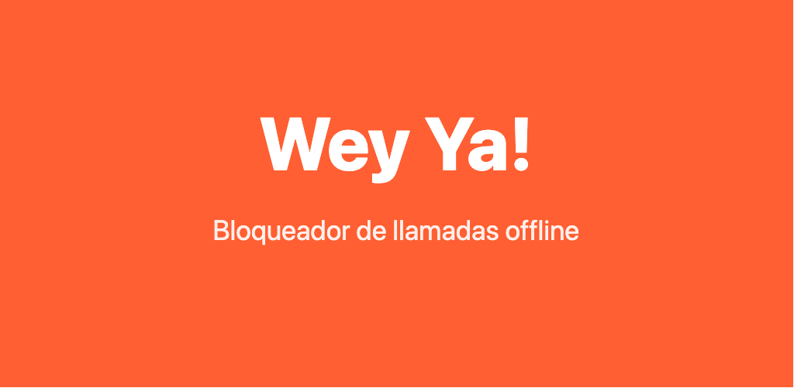
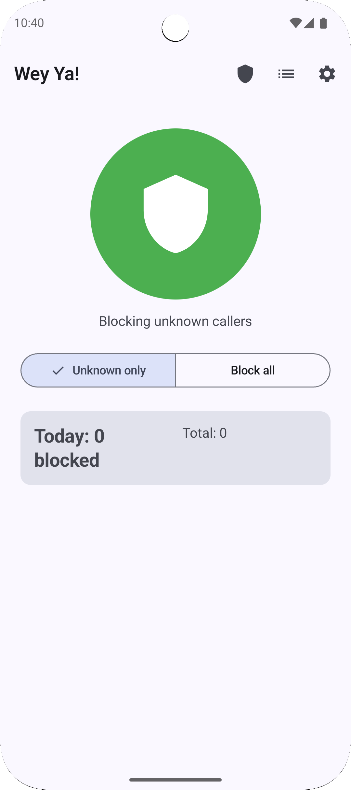
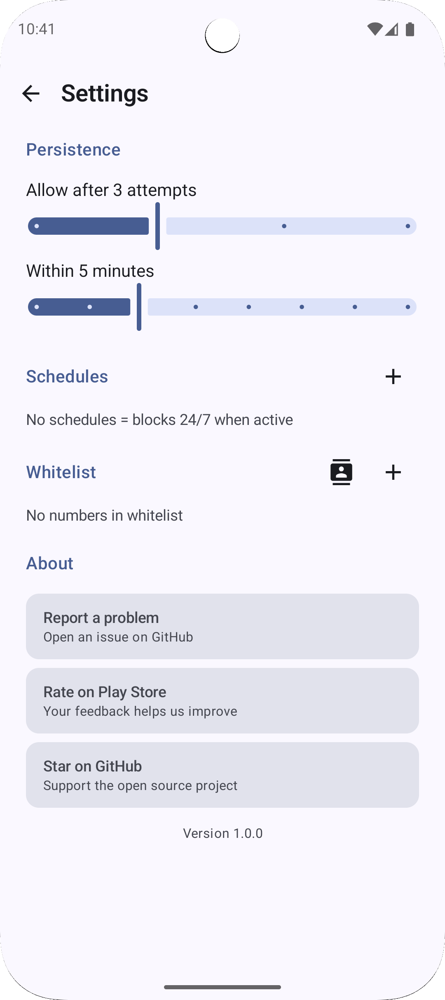

<p align="center">
  
</p>

# Wey Ya!

Bloqueador de llamadas spam para Android. Sin internet. Sin analytics. Sin anuncios. Todo local.

## Filosofia

**0 bytes enviados a internet. Nunca.**

Wey Ya! es una app de codigo abierto que bloquea llamadas no deseadas sin conectarse a ningun servidor. No recopila datos, no muestra publicidad, no tiene permisos de red. Tu informacion nunca sale de tu telefono.

<p align="center">
  
  &nbsp;&nbsp;
  
</p>

## Features

- **Dos modos de bloqueo**: solo desconocidos o bloquear todo
- **Bypass de urgencia**: si alguien llama N veces en X minutos, la llamada pasa (configurable)
- **Horarios**: define cuando bloquear (soporta cruce de medianoche y multiples dias)
- **Whitelist**: agrega numeros manualmente o desde contactos
- **Widget**: toggle rapido y estadisticas en tu home screen (Jetpack Glance)
- **Quick Tile**: activa/desactiva desde el panel de ajustes rapidos
- **Privacy Dashboard**: auditoria de permisos en tiempo real, estadisticas de bloqueo
- **Historial**: log de llamadas bloqueadas con filtros y exportacion CSV
- **i18n**: Espanol, Ingles, Portugues, Hindi, Indonesio

## Stack

| Capa | Tecnologia |
|------|-----------|
| UI | Jetpack Compose + Material 3 |
| Arquitectura | MVVM + Hilt DI |
| Base de datos | Room |
| Preferencias | DataStore |
| Widget | Jetpack Glance 1.1.1 |
| Servicio | CallScreeningService (API 29+) |
| Min SDK | 29 (Android 10) |
| Target SDK | 35 |
| Lenguaje | Kotlin 2.1.0 |

## Compilar

```bash
git clone https://github.com/samumirandam/wey-ya.git
cd wey-ya
./gradlew assembleDebug
```

El APK estara en `app/build/outputs/apk/debug/`.

## Tests

```bash
./gradlew test
```

## Contribuir

- Reporta bugs o sugiere features en [GitHub Issues](https://github.com/samumirandam/wey-ya/issues)
- PRs bienvenidos

## Privacidad

[Politica de privacidad](docs/privacy-policy.html) — TL;DR: no recopilamos nada, nunca.

## Licencia

GPL-3.0. Ver [LICENSE](LICENSE).
