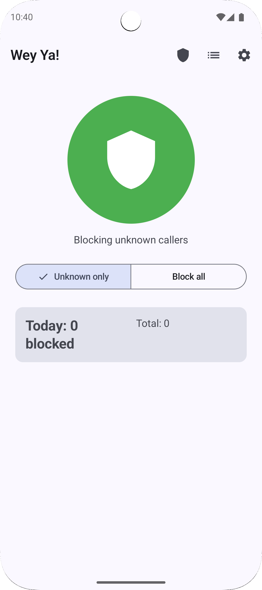
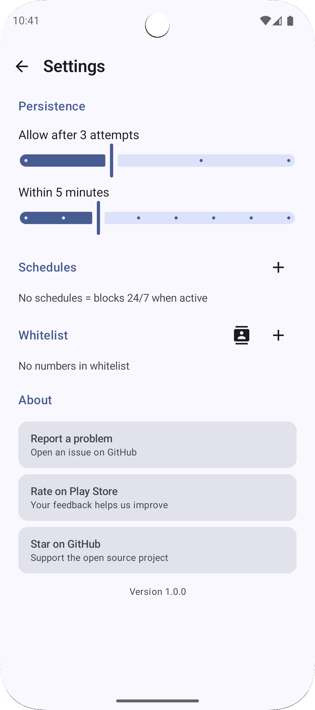

<p align="center">
  
</p>

# Wey Ya!

Spam call blocker for Android. No internet. No analytics. No ads. Fully local.

## Philosophy

**0 bytes sent to the internet. Ever.**

Wey Ya! is an open source app that blocks unwanted calls without connecting to any server. It collects no data, shows no ads, and has no network permissions. Your information never leaves your phone.

<p align="center">
  
  &nbsp;&nbsp;
  
</p>

## Features

- **Two blocking modes**: unknown callers only or block everything
- **Urgency bypass**: if someone calls N times within X minutes, the call passes through (configurable)
- **Schedules**: define when to block (supports midnight crossing and multiple days)
- **Whitelist**: add numbers manually or from contacts
- **Widget**: quick toggle and stats on your home screen (Jetpack Glance)
- **Quick Tile**: enable/disable from the quick settings panel
- **Privacy Dashboard**: real-time permission audit, blocking stats
- **History**: blocked call log with filters and CSV export
- **i18n**: English, Spanish, Portuguese, Hindi, Indonesian

## Stack

| Layer | Technology |
|------|-----------|
| UI | Jetpack Compose + Material 3 |
| Architecture | MVVM + Hilt DI |
| Database | Room |
| Preferences | DataStore |
| Widget | Jetpack Glance 1.1.1 |
| Service | CallScreeningService (API 29+) |
| Min SDK | 29 (Android 10) |
| Target SDK | 35 |
| Language | Kotlin 2.1.0 |

## Build

```bash
git clone https://github.com/samumirandam/wey-ya.git
cd wey-ya
./gradlew assembleDebug
```

The APK will be at `app/build/outputs/apk/debug/`.

## Tests

```bash
./gradlew test
```

## Contributing

- Report bugs or suggest features at [GitHub Issues](https://github.com/samumirandam/wey-ya/issues)
- PRs welcome

## Privacy

[Privacy policy](docs/privacy-policy.html) — TL;DR: we collect nothing, ever.

## License

GPL-3.0. See [LICENSE](LICENSE).
